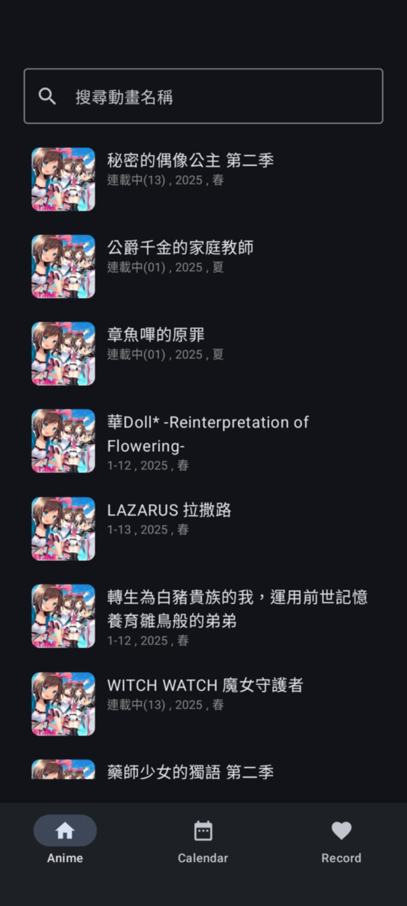
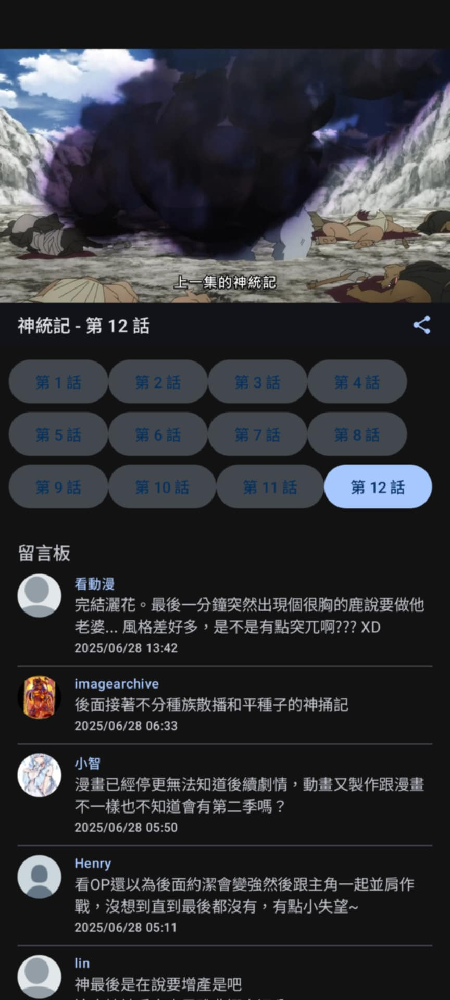
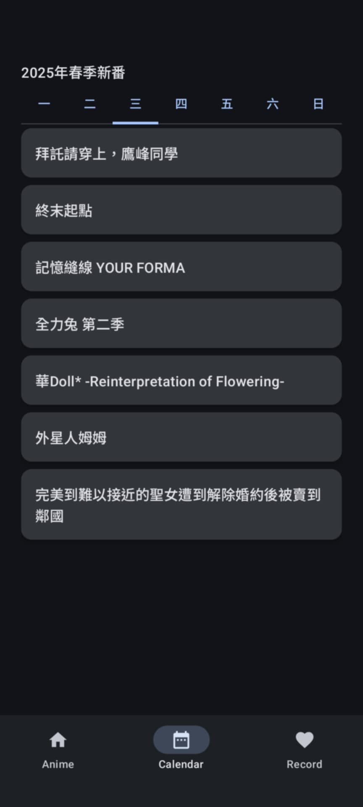
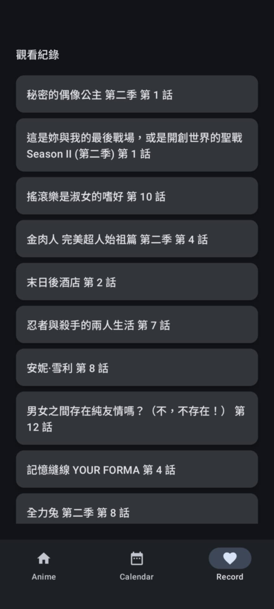

# 🎬 mxAnime

一款用於觀看動畫的 Android App，串接 [anime1.me](https://anime1.me) 網站，實現動畫資料獲取、播放、收藏等功能。專為 Jetpack Compose 設計，支援 Media3 播放器，打造現代流暢的使用體驗。

## ✨ 功能特色

-  支援動畫列表與搜尋功能  
-  支援依照季度/更新日分類顯示  
-  使用 Media3 ExoPlayer 播放影片  
-  自動解析 API 回傳的播放連結  
-  支援留言板功能（整合 [Disqus](https://disqus.com) API）  
-  支援收藏與觀看紀錄  
-  下拉重新整理與分頁載入（Paging 3）

## 🖼️ 截圖展示

| 動畫列表 | 播放畫面 | 動畫季度表 | 觀看紀錄 |
|----------|----------|------------|----------|
|  |  |  |  |

## 🧱 技術架構

- **語言**：Kotlin  
- **UI 框架**：Jetpack Compose  
- **架構**：MVVM + Clean Architecture  
- **資料管理**：ViewModel + StateFlow  
- **分頁與刷新**：Paging 3 + PullRefresh  
- **播放器**：AndroidX Media3 ExoPlayer
- **DI 框架**：Koin (Koin Annotations )  
- **測試框架**：Kotest（單元測試）

## 🚧 開發計畫中

以下功能目前尚未開始開發，預計於後續版本加入：

- 影片編輯模式 (截圖、GIF convert、片段收藏) 
- 離線影片快取與播放  
- 留言功能


## 🚀 開始使用

你可以選擇以下兩種方式體驗 App：

### ✅ 方式一：本地建置

```bash
git clone https://github.com/tks3589/animeone.git
cd animeone
./gradlew installDebug
```

### 📦 方式二：下載 APK
👉 [點我下載 APK](https://drive.google.com/file/d/17AloTsZafuCQCu41Ni6QZSi__ZO7_RGY/view)